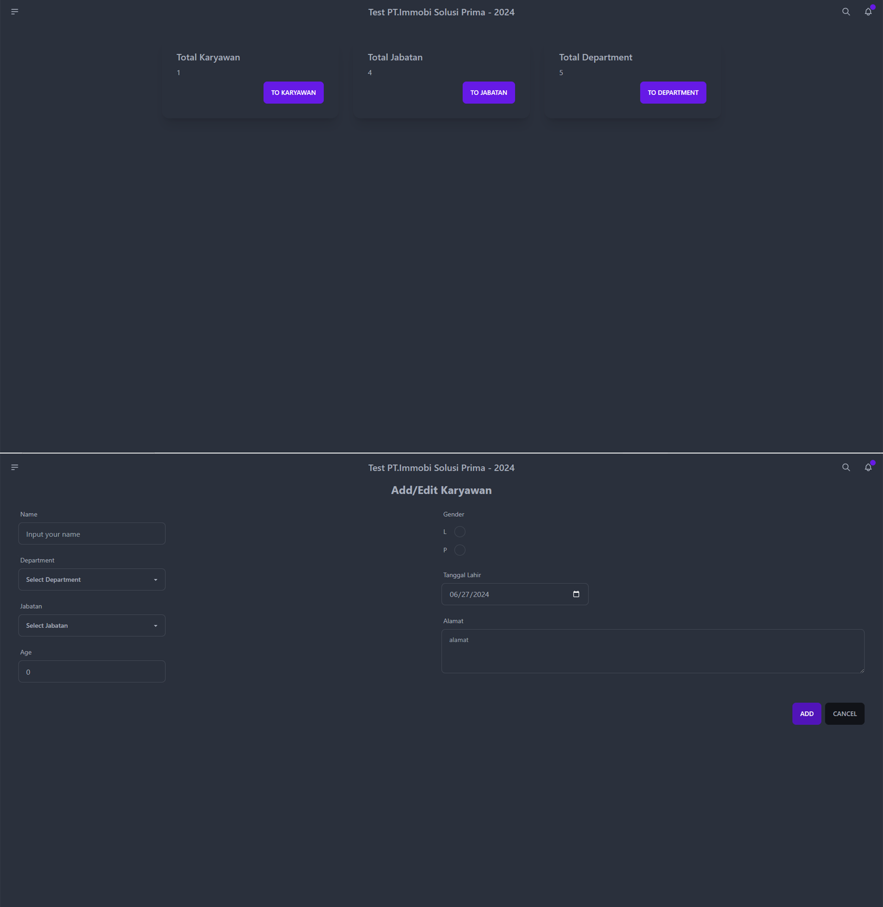

<h1 align="center">
  <a href="https://github.com/Alamnzr123/frontend_test2">
   Front-end Test for PT IXXoXXXiXXX
  </a>
  <br />
</h1>



To run Application you need install Backend and Frontend side, which is Mandatory
This repo include Frontend that buid using ReactJS. For Backend clone this Repo
**https://github.com/Alamnzr123/backendtest_2**


## Getting Started

This is a [Vite](https://vitejs.dev/) project bootstrapped with [`npm create vite@latest`](https://vitejs.dev/guide/).

First, Install Depedency:

```bash
npm install
```

Second, run the development server:

```bash
npm run dev
# or
yarn dev
```

Open [http://localhost:4000](http://localhost:4000) with your browser to see the result.

You can start editing the page by modifying `src/index.jsx`. The page auto-updates as you edit the file.

## Deploy on Vercel

The easiest way to deploy your Next.js app is to use the [Vercel Platform](https://vercel.com/new?utm_medium=default-template&filter=next.js&utm_source=create-next-app&utm_campaign=create-next-app-readme) from the creators of Next.js.

Check out our [Next.js deployment documentation](https://nextjs.org/docs/deployment) for more details.

## Credits
- [TailwindCSS](https://tailwindcss.com/) Modern styling for ReactJS
